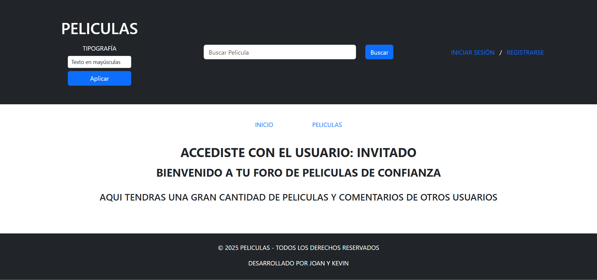
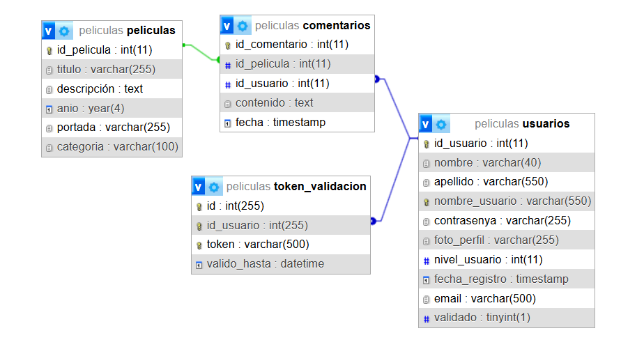
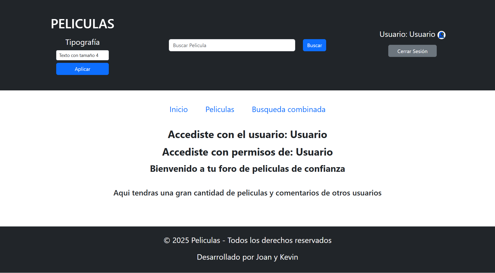
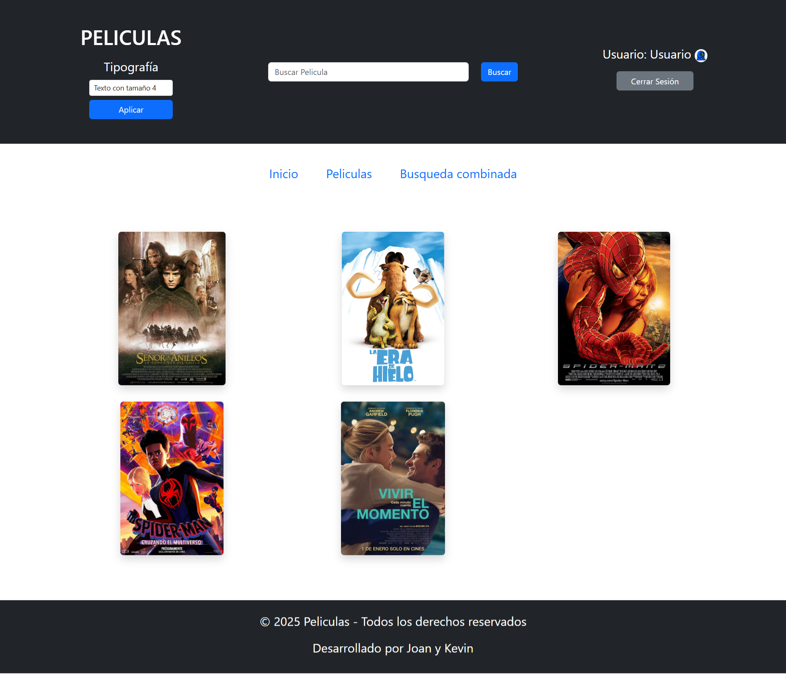
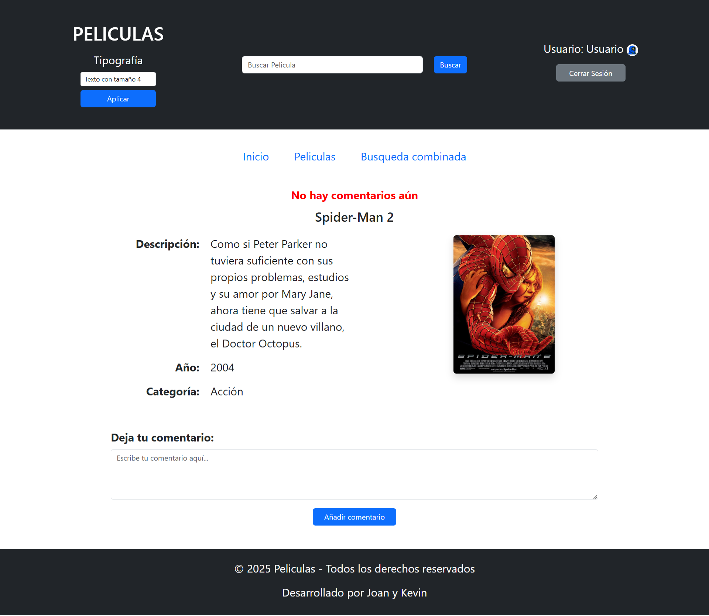

# Web de Peliculas usando la arquitectura MVC (Model View Controller)

Aplicación web de películas diseñada para explorar, interactuar y gestionar contenido sobre películas. Los usuarios pueden navegadr por el catálogo de películas disponibles, ver detalles como sinopsis, año de lanzamiento y portada de la película. 
Además, cuenta con funciones interactivas como la posibilidad de agregar comentarios sobre las películas (para ello debe estar registrado previamente).

La aplicación está dividida en zonas públicas y privadas, dependiendo del nivel de acceso del usuario:
* **Zona pública:** los usuarios no logueados(invitados) pueden explorar el catálogo y visualizar las películas.
* **Zona privada:** una vez registrados e iniciada la sesión, los usuarios tienen acceso a funciones adicionales, como comentar las películas.

También cuenta con un **sistema de administración** que es el que gestiona tanto usuarios como películas, accesible únicamente por usuarios con ***rol de administrador.***

## Funcionalidades

- **Explorar películas:** navegar por el catálogo de películas disponibles.
- **Ver detalles de películas:** visualizar información detallada de cada película, incluyendo sinopsis, año de lanzamiento y portada.
- **Registro y autenticación:** los usuarios pueden registrarse y autenticarse para acceder a funciones adicionales.
- **Agregar comentarios:** los usuarios registrados pueden agregar comentarios a las películas.
- **Verificación de cuenta:** los usuarios deben verificar su cuenta a través de un enlace enviado por correo electrónico.

## Tecnologías utilizadas

- **Backend:** PHP.
- **Frontend:** HTML, CSS, Bootstrap.
- **Base de datos:** MySQL.
- **Librerías:** PHPMailer para el envío de correos electrónicos.
- **Servidor web:** Apache.

---

# Base de datos

---

# Preview de la web (Accediendo como usuario logueado)

